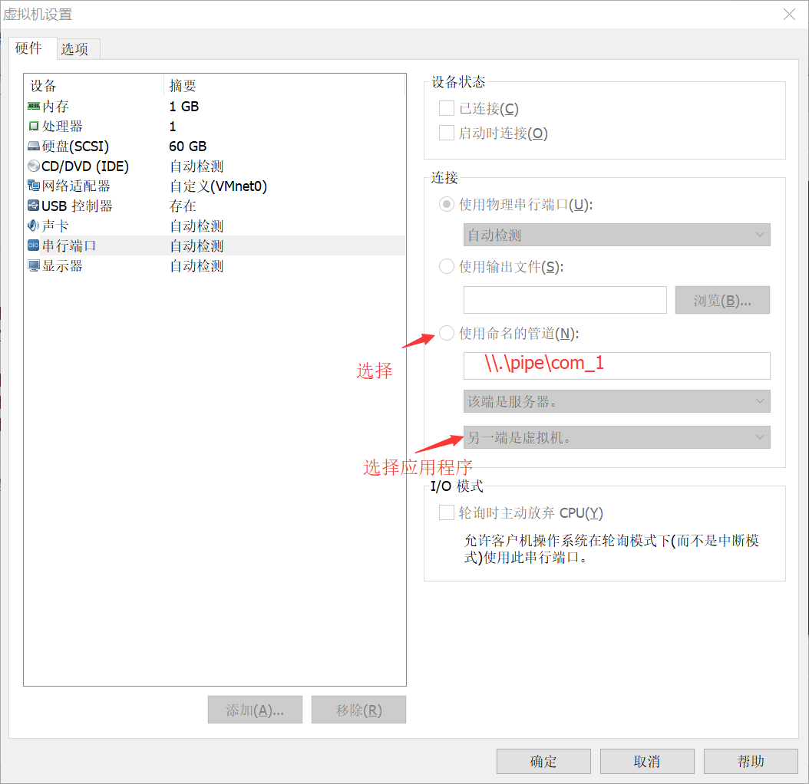
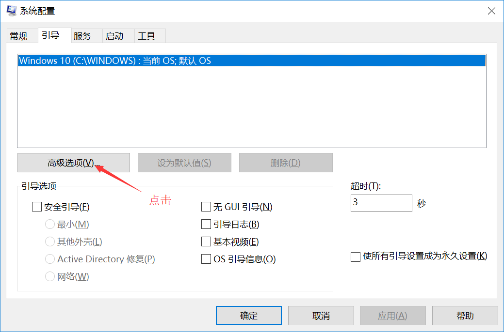
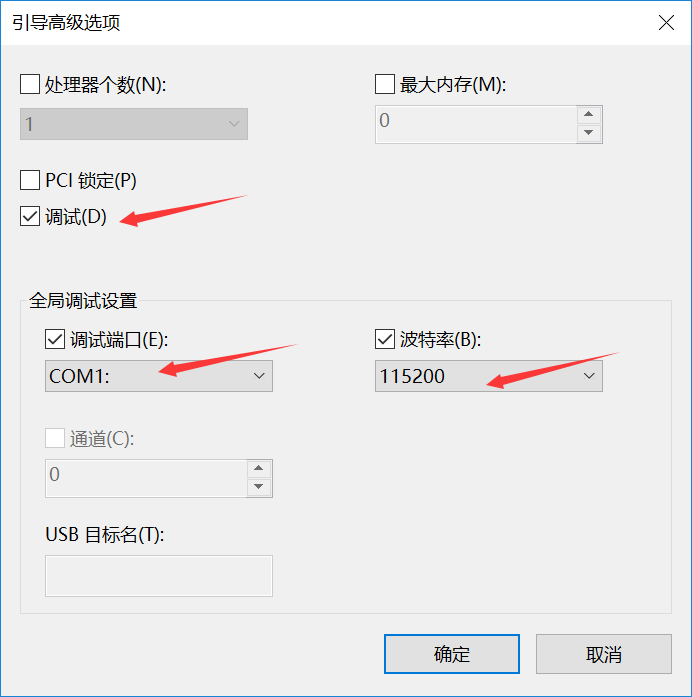

 
#  [目录](README.md) 

#### 1.1.1. 简述 
    
WDF是微软提出的全新驱动程序模型,它提供了面向对象、事件驱动的驱动程序开发框架,对它的研究是设计高效稳定设备驱动程序的基础。

WDF(Windows Driver Foundation)是微软提出的下一代全新的驱动程序模型,它是在WDM(Windows Driver Model)的基础上发展而来的,支持面向对象、事件驱动的驱动程序开发,提供了比WDM更高层次抽象的高度灵活、可扩展、可诊断的驱动程序框架。WDF框架管理了大多数与操作系统相关的交互,实现了公共的驱动程序功能(如电源管理、PNP支持),隔离了设备驱动程序与操作系统内核,降低了驱动程序对内核的影响。
    
WDF提供了两个框架:KMDF(内核模式驱动程序框架)和UMDF(用户模式驱动程序框架) 

本笔记使用开发只涉及KMDF框架，工具是基于Virtual Studio 2017的 WDK10开发。  

#### 1.1.2. WDF开发工具安装 

（1） 下载VS2017，安装Window 10 SDK； 安装包路径自行网络下载

（2） 安装完成后显示如下图


#### 1.1.3. WDF 调试环境 

window驱动开发调试环境支持真机调试和虚拟机调试。调试方式主要分为两大类本机调试、双机调试。双机调试通信方式有可以分为串口通信、网络通信、USB通信等方式。 

win7系统支持串口通信，但不支持网络通信； 
win10系统支持串口通信，同事也支持网络通信方式。方便后面在真机上的调试开发。 

#### 1.1.4. 双机调试 

（1）安装WDK后，将安装包中联调驱动程序安装。

 参考默认安装路径：分别为64位系统和32位系统
``` 
C:\Program Files (x86)\Windows Kits\10\Remote\x64\WDK Test Target Setup x64-x64_en-us     //64位调试驱动包
C:\Program Files (x86)\Windows Kits\10\Remote\x86\WDK Test Target Setup x86-x86_en-us     //32位调试驱动包
``` 

（2）虚拟机串口调试配置

设置-->添加-->串型接口-->输出到命名管道； 创建命名管道后，再配合虚拟系统上的引导属性，将调试信息
串口输出。 



（3）虚拟机上配置串口通信 

在电脑上运行命令窗口输出msconfig 

然后选择引导项中设置相关属性；从笔记中当前系统中只有一个可引导的系统；在实际调试中，还可以通过bcdedit创建系统副本。 为什么使用系统副本，如何使用系统副本将在下一章详细说明。 



设置完成后，保存重启系统。

#### 1.1.5. 本节总结

WDK开发环境比较复杂，对于没有window驱动开发基础，学习起来比普通应用程序开发难度是极大的。本章也是针对WDK开发环境进行简单流程性表述，可根据笔记中的步骤，完成每一个步骤；从而搭建好WDK开发环境。要点： 

* 开发环境（visual studio2017，虚拟机，真机）
* 调试环境（bcdedit，windbg）
