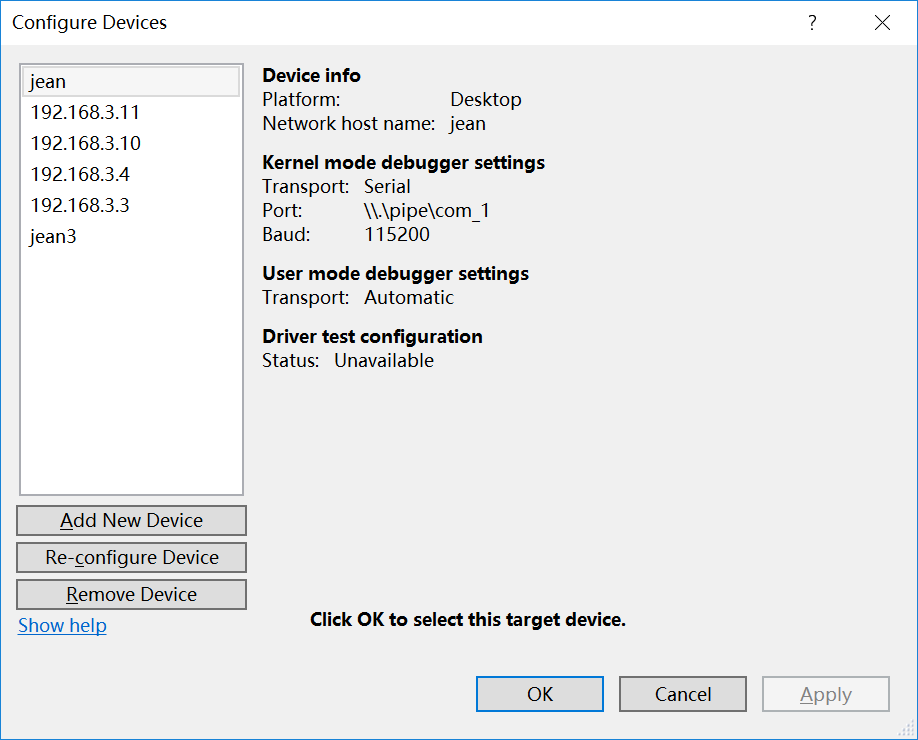

 
## [目录](README.md) 
### 1.3.1. windbg简述 

windbg是在windows平台下，强大的用户态和 内核态调试工具。相比较于Visual Studio,它是一个轻量级的调试工具，所谓轻量级指的是它的安装文件大小较小，但是其调试功能，却比VS更为强大。它的另外一个用途是可以用来分析 dump数据。

通过windbg可以对WDF驱动程序进行在线调试，也可以简单的输出显示调试功能。 在线调试能够设置断点、单步骤运行输出运行时栈信息等调试操作。本笔记只是涉及简单调试使用，更加复杂详细的windbg调试步骤自行搜索了解。 

### 1.3.2. windbg使用

（1）工具路径

一般windbg工具都在安装路径下 
C:\Program Files (x86)\Windows Kits\10\Debuggers\x64\windbg.exe 

（2）环境配置 

在线驱动调试，需要用到文字符号；否则在联调时候无法断点调试。基础配置方式方式，
在【我的电脑】-【属性】-【高级系统设置】-【高级】-【环境变量】中添加新的变量项。

    变量名： _NT_SYMBOL_PATH 
    变量值：  c:\pro\mysymbol;SRV*c:\pro\mysymbol*http://msdl.microsoft.com/download/symbols 

### 1.3.3. VS中创建联调 

（1）打开VS工具，配置调试设备

    显示如下图：

（2）串口调试模式
    
    Transport：Serial 串口类型 
    Port：虚拟机建立虚拟管道 
    Baud：115200 前面章节msconfig配置调试时设置波特率一致
    配置完成如下图所示：

（3）网络调试模式 

    Network host name: 目标机子IP 
    Transport： Network 
    Port：  5000   要和前面章节bcdedit配置网络模式时的端口一致
    Key： 前面目标机子上的密码
    HostIP： 本机调试IP地址 
    配置完成如下图所示：   

