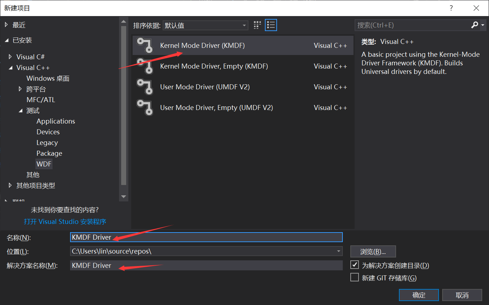
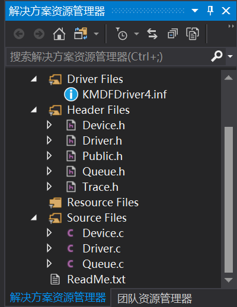
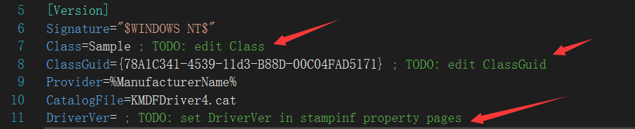
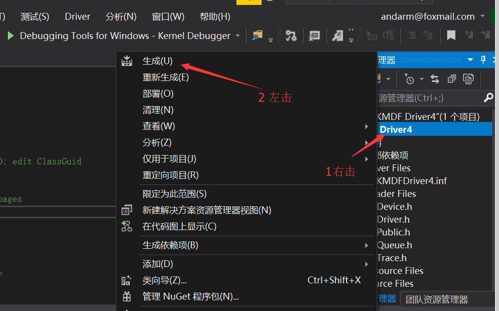
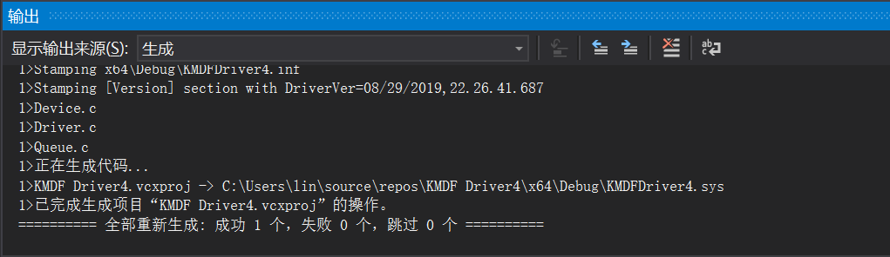
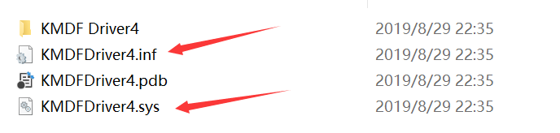

# [目录](README.md)

#### 3.1.1.创建工程 

创建工程，选择KDMF类型，选择第一个项目会自动生成驱动相关文件；选择完之后点击【确定】

然后生成的文件就会显示在解决方案中

上图中【Driver Files】主要是驱动安装配置文件相关信息，基本初次认识驱动程序不需要做任何修改即可编译出驱动例程。当然日后开发用户可以根据自己需要自动修改内容。 

#### 3.1.2.开发编译工程

编译步骤在【解决方案】中右击，然后选择【生成】

编译完成后，会在输出窗口上显示成功

同时打开工程目录文件夹下，会看到下面文件；将鼠标移动到【解决方案】右击，然后选择【在文件资源管理器中打开文件夹】
然后文件夹下生成【x64】-【Debug】文件夹;该文件夹后面调试需要用到调试文件已经完成。 

#### 3.1.3.调试工程 

将编译步骤中生成的文件直接复制到目标电脑上。下面调试步骤如下：

- 目标电脑进入调试模式
- vs2017工具打开windbg模式
- 目标电脑上安装KMDFDriver4.sys驱动文件
- 驱动正常安装完成

