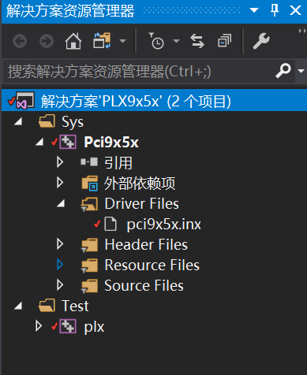
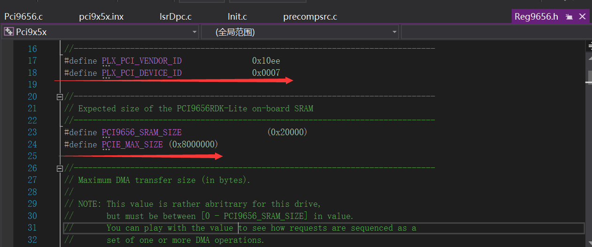

# [目录](README.md)

#### 3.2.1.工程描述 

在创建工程前先简述一下这个驱动例程的主要功能，编译生成能够通过IO控制方式进行PCIE通信。IO控制方式可以理解为内核驱动层中将PCIE的物理地址映射到PC中，然后PC想对应地址写数据。例如：映射PCIE bar0区地址空间，向该地址写入任意值，也同时可以读取该地址值。如该地址对应的PCIE是控制LED，那LED就能被控制亮和灭。如果PCIE是关联继电器就能够控制继电器开和关等功能。 

下面学习的例子是从一开始网络上搜索资料获取到例程，然后从别人的例程基础上修改。从一个初学PCIE驱动入门者的角度，将PCIE简单控制应用。同时在个人的github中会将文档中修改的工程上传。
[PCIE 例程 ](https://github.com/andarm/Spw_PCIe_Adapter_Software_using_WDF_and_Qt/tree/master/Spw_PCIe_driver_WDF)

在例子中为了能够从最简单的角度入门PCIE驱动开发，后面需要扩展的修改，都可以基于例程上自行修改。 

官方例程项目如下图：


#### 3.2.2.PCIE IO方式编程开发 

- （1）驱动配置信息修改
```
; DisplayName           Section           DeviceId
; -----------           -------           --------
%Pci9056.DRVDESC%=      Pci9x5x_Inst,     PCI\VEN_10ee&DEV_0007
``` 

从上面的内容中，需要我们手动修改的也就只有DeviceId，每款PCIE板卡的vendor和deviceID都可能不一样，这需要根据实际情况来修改。笔记中使用的PCIE板卡其值是
 PCI\VEN_10ee&DEV_0007。另外，一般拿到需要对接的PCIE板卡一般都会有对应的说明书，如果没有那也可联系FAE。当然用户也是可以通过windriver获取到。这里就不一一举例，想了解如何获取可以自行搜索。 

 从上面的配置文件中，还需要注意就是ClassGuid,应用程序就通过这个GUID找到对应驱动程序从而通信。因此在后面的修改测试程序中，需要将去驱动中用到的ClassGuid和应用程序的对应上。 

 - （2）驱动内容修改 

 每一款PCIE板卡，其定义和规划的寄存器内容会有所不一样。PCIE驱动和单片机驱动几乎一样。而单片机的驱动就是根据手册往对应地址写入特定值，然后物理硬件就会执行相关工作。 

从前面章节可以知道驱动的入口函数，那现在就直接从入口函数一一分析例程是如果通过IO方式通信。 
-  （3）入口函数DriverEntry
```
    // Initialize the Driver Config structure.
    WDF_DRIVER_CONFIG_INIT( &config, PLxEvtDeviceAdd );
        -- PLxEvtDeviceAdd
            -- PLxEvtDevicePrepareHardware
                -- PLxPrepareHardware //这个函数就是将PCIE硬件资源和PC进行映射
```  
- （4）资源映射

    * 将PCIE板卡接入PC上，PC也会根据PCIE默认通信地址获取到相关资源，驱动程序只需将第一步中的驱动Vendor和deviceID传入，PC自然能获取相应的硬件资源。在代码上直接就由下面函数返回： 
    ``` 
     for (i=0; i < WdfCmResourceListGetCount(ResourcesTranslated); i++) {

        desc = WdfCmResourceListGetDescriptor( ResourcesTranslated, i );
    ``` 

    WdfCmResourceListGetCount 资源个数 ； 
    WdfCmResourceListGetDescriptor 资源的详细描述，这里PCIE资源内容都会在返回的结构体中，驱动程序只需要将数据提取出来映射。硬件资源转换数据值，可以不深究；而驱动目的是通过数据值地址来控制PCIE，实现目的需要我们修改的才是我们要深究的。如下就是需要修改内容： 

``` 
  for (i=0; i < WdfCmResourceListGetCount(ResourcesTranslated); i++) {

        desc = WdfCmResourceListGetDescriptor( ResourcesTranslated, i );

        if(!desc) {
            TraceEvents(TRACE_LEVEL_ERROR, DBG_PNP,
                        "WdfResourceCmGetDescriptor failed");
            return STATUS_DEVICE_CONFIGURATION_ERROR;
        }
		KdPrintEx((DPFLTR_IHVAUDIO_ID, DPFLTR_ERROR_LEVEL, "JeanTest| desc->type=%d\n", desc->Type));  
        switch (desc->Type) {

            case CmResourceTypeMemory:

                bar = NULL;
                KdPrintEx((DPFLTR_IHVAUDIO_ID, DPFLTR_ERROR_LEVEL, "JeanTest|i=%d,start=0x%x,Length= 0x%x\n",i, desc->u.Memory.Start,desc->u.Memory.Length));

                if (foundSRAM && !foundSRAM2 &&
                    desc->u.Memory.Length == PCI9656_SRAM_SIZE) {

                    //SRAM2BasePA = desc->u.Memory.Start;
                    //SRAM2Length = desc->u.Memory.Length;
                    foundSRAM2 = TRUE;
                    bar = "BAR3";
                   KdPrintEx((DPFLTR_IHVAUDIO_ID, DPFLTR_ERROR_LEVEL, "bar3 Start is 0x%p\n", desc->u.Memory.Start,desc->u.Memory.Length));

                }

                if (foundRegs && !foundSRAM &&
                    desc->u.Memory.Length == PCIE_MAX_SIZE) {

                    SRAMBasePA = desc->u.Memory.Start;
                    SRAMLength = desc->u.Memory.Length;
                    foundSRAM = TRUE;
                    bar = "BAR2";
                    KdPrintEx((DPFLTR_IHVAUDIO_ID, DPFLTR_ERROR_LEVEL, "bar2 Start is 0x%p\n", desc->u.Memory.Start,desc->u.Memory.Length));

                }
                //0x200 
                if (!foundRegs &&
                    desc->u.Memory.Length == PCIE_MAX_SIZE) {

                    regsBasePA = desc->u.Memory.Start;
                    regsLength = desc->u.Memory.Length;
                    foundRegs = TRUE;
                    bar = "BAR0";
                    KdPrintEx((DPFLTR_IHVAUDIO_ID, DPFLTR_ERROR_LEVEL, "bar0 Start is 0x%p\n", desc->u.Memory.Start,desc->u.Memory.Length));

                }

                TraceEvents(TRACE_LEVEL_INFORMATION, DBG_PNP,
                            " - Memory Resource [%I64X-%I64X] %s",
                            desc->u.Memory.Start.QuadPart,
                            desc->u.Memory.Start.QuadPart +
                            desc->u.Memory.Length,
                            (bar) ? bar : "<unrecognized>" );
                break;

            case CmResourceTypePort:

                bar = NULL;
                KdPrintEx((DPFLTR_IHVAUDIO_ID, DPFLTR_ERROR_LEVEL, "JeanTest|bar1 length:%d\n", desc->u.Port.Length));

                if (!foundPort &&
                    desc->u.Port.Length >= 0x100) {
                    foundPort = TRUE;
                    bar = "BAR1";
                }

                TraceEvents(TRACE_LEVEL_INFORMATION, DBG_PNP,
                            " - Port   Resource [%08I64X-%08I64X] %s",
                            desc->u.Port.Start.QuadPart,
                            desc->u.Port.Start.QuadPart +
                            desc->u.Port.Length,
                            (bar) ? bar : "<unrecognized>" );
                break;
            case CmResourceTypeInterrupt:
                 KdPrintEx((DPFLTR_IHVAUDIO_ID, DPFLTR_ERROR_LEVEL, "JeanTest| interrupt type :%d\n", i));
            //       KdPrintEx((DPFLTR_IHVAUDIO_ID, DPFLTR_ERROR_LEVEL,
            // "Message Interrupt level 0x%0x, Vector 0x%0x, MessageCount %u\n"
            // , desc->u.MessageInterrupt.Translated.Level
            // , desc->u.MessageInterrupt.Translated.Vector
            // , desc->u.MessageInterrupt.Raw.MessageCount
            // ));
            	KdPrintEx((DPFLTR_IHVAUDIO_ID, DPFLTR_ERROR_LEVEL, "descriptor->u.MessageInterrupt.Translated.Level is %x\n", desc->u.MessageInterrupt.Translated.Level));
				KdPrintEx((DPFLTR_IHVAUDIO_ID, DPFLTR_ERROR_LEVEL, "descriptor->u.MessageInterrupt.Translated.Vector is %x\n", desc->u.MessageInterrupt.Translated.Vector));
				KdPrintEx((DPFLTR_IHVAUDIO_ID, DPFLTR_ERROR_LEVEL, "descriptor->u.MessageInterrupt.Raw.MessageCount is %x\n", desc->u.MessageInterrupt.Raw.MessageCount));
				KdPrintEx((DPFLTR_IHVAUDIO_ID, DPFLTR_ERROR_LEVEL, "descriptor->u.MessageInterrupt.Raw.Vector is %x\n", desc->u.MessageInterrupt.Raw.Vector));

                KdPrintEx((DPFLTR_IHVAUDIO_ID, DPFLTR_ERROR_LEVEL, "The Interrupt descriptor analysis begins!\n"));
				//设置IoConnectInterruotEx函数所需的变量
				IO_CONNECT_INTERRUPT_PARAMETERS params;
				RtlZeroMemory(&params, sizeof(params));
				params.Version = CONNECT_MESSAGE_BASED;
				params.MessageBased.PhysicalDeviceObject = DevExt->Device;
				params.MessageBased.MessageServiceRoutine = PCIe_InterruptMessageService;
				params.MessageBased.ServiceContext = (PVOID)&DevExt->InterruptContext;
				params.MessageBased.SynchronizeIrql = 0;
				params.MessageBased.FloatingSave = FALSE;
				params.MessageBased.ConnectionContext.InterruptObject = &pDeviceContext->Interrupt;
				params.MessageBased.SpinLock = &pDeviceContext->SpinLock;
				
				//将设备上下文赋给中断上下文(后续使用MSI时很重要)
				pDeviceContext->InterruptContext.DeviceContext = pDeviceContext;
				//Default state is low
				pDeviceContext->State = 0;
				status = IoConnectInterruptEx(&params);
				if (NT_SUCCESS(status))
				{
					KdPrintEx((DPFLTR_IHVAUDIO_ID, DPFLTR_ERROR_LEVEL, "The MSI gets interrupt rountine successfully!\n"));
				}
				else
					KdPrintEx((DPFLTR_IHVAUDIO_ID, DPFLTR_ERROR_LEVEL, "The MSI gets interrupt rountine falied!\n"));
                 break;
            case CmResourceTypeDma:
             KdPrintEx((DPFLTR_IHVAUDIO_ID, DPFLTR_ERROR_LEVEL, "JeanTest| Type DMA  :%d\n", i));

			case CmResourceTypeDevicePrivate:
			KdPrintEx((DPFLTR_IHVAUDIO_ID, DPFLTR_ERROR_LEVEL, "JeanTest|CmResourceTypeDevicePrivate i=%d,start=0x%x,Length= 0x%x\n", i, desc -> u.Memory.Length));
			desc->u.DevicePrivate
            break;  

            default:
                //
                // Ignore all other descriptors
                //
                break;
        }
    }
``` 
从上面代码看是很长一段，但实际中也就在例程基础上增加了很大调试打印信息，通过KdPrintEx函数。 KdPrintEx函数初学时只需理解调试内核可以打印出各个变量值显示在调试平台的函数。 

上面的代码用户完成不用做任何修改，只显示需要的调试信息，从而修改了下面的内容：



修改完成后，用关注的信息点就是
regsBasePA = desc->u.Memory.Start;
regsLength = desc->u.Memory.Length;
regsBasePA 从变量名字知道就是PCIE寄存器的基地址，然后驱动程序需要将这个地址映射到本地通过下面函数 
  DevExt->RegsBase = (PUCHAR) LocalMmMapIoSpace(regsBasePA,
                                                  regsLength);
经过一轮映射，实际后面驱动操作的就是DevExt->RegsBase 这寄存器的值。 这里对应我们使用的板卡就是BAR0配置寄存器的相关内容。后面根据这个地址就能够完成最简单的寄存器读写操作。 

- （5）PCIE寄存器写操作

WDF会将这个写请求给创建，我们只需要在驱动程序中将自己需要操作的内容修改。
queueConfig.EvtIoWrite = PLxEvtIoWrite; 这里需要注意在例程中时DMA驱动方式，而且我们目前还是IO控制方式，因此需要将大量DMA相关的内容屏蔽即可。 


#### 3.2.3.调试工程 


